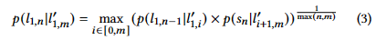
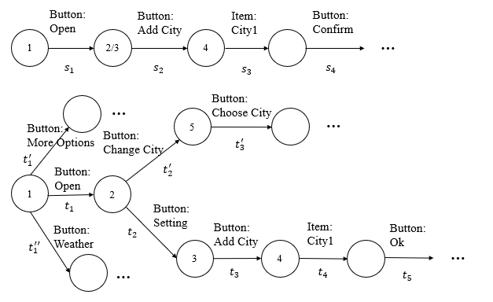

# Supplementary Files for Review:

## *1.running example of equation 3*

**equation 3 :**

**running example:**

To simplify the illustration, we set the GUI similarity to be the same as the event similarity, and use the event list to represent the state transition list.

And event similarity is 1 if all words matched (e.g., City1 to City1); 0.5 if part of words matched (e.g., City1 to Add City); or 0.1 if none of the words are matched.

So $p(s|\phi)$ is set to be the minimum value of event similarity, i.e., 0.1.

For the given two apps, the correct mapping of STL $s_1s_2s_3s_4$ should be $t_1t_2t_3t_4t_5$.

Apparently, $s_1$ (Button:Open) is matched to $t_1$ (Button:Open) no matter if $w$ is 1, 2, or 3.

So the question changed to decide whether $s_2$ should be mapped to $t_2$ or $t'_2$.

When $w$ is 1, $s_2$ will be mapped to $t'_2$ since $p(s_2|t'_2)$ = 0.5, which is higher than $p(s_2|t_2) = 0.1$. The matching is wrong.

The mapping result will also incorrect if $w$ increases to be 2. Since $p(s_2s_3|t'_2t'_3)=0.25$ while $p(s_2s_3|t_2t_3)=0.025$.

However, when $w$ is 3, the list $t_2t_3t_4$ performs better than $t'_2t'_3$ as $p(s_2s_3s_4|t'_2t'_3\phi) = 0.025$ but  $p(s_2s_3s_4|t_2t_3t_4) = 0.1$.

## *2.references*

**[ASE’18]** Moran, Kevin, Cody Watson, John Hoskins, George Purnell, and Denys Poshyvanyk. "Detecting and summarizing GUI changes in evolving mobile apps." In Proceedings of the 33rd ACM/IEEE international conference on automated software engineering, pp. 543-553. 2018.

**[ISSTA’19]** Qin, Xue, Hao Zhong, and **aoyin Wang. "Testmig: Migrating gui test cases from ios to android." In Proceedings of the 28th ACM SIGSOFT International Symposium on Software Testing and Analysis, pp. 284-295. 2019.

**[ISSTA’21]** Mariani, Leonardo, Ali Mohebbi, Mauro Pezzè, and Valerio Terragni. "Semantic matching of gui events for test reuse: are we there yet?." In Proceedings of the 30th ACM SIGSOFT International Symposium on Software Testing and Analysis, pp. 177-190. 2021.

**[ICSE’24]** Cao, Shaoheng, Minxue Pan, Yu Pei, Wenhua Yang, Tian Zhang, Linzhang Wang, and Xuandong Li. "Comprehensive Semantic Repair of Obsolete GUI Test Scripts for Mobile Applications." In Proceedings of the IEEE/ACM 46th International Conference on Software Engineering, pp. 1-13. 2024.

# The contents of each directory:

## *apk*

All the apks we used in the experiment.

## *apkTestScript*

All the test scripts we used in the experiment.

## *groundTruth*

Ground truth for all obsolete test scripts.

## *repairResult*

Test repair results of all methods in the experiment.

## *sourceCode*

Source code for the ExtRep method.

# How to run the code of ExtRep method:

## *environment*

python(3.8+) + Appium(1.7.2+) + adb + MuMu Simulator(Android 6+)

## *python package*

gensim: 3.8.3
scipy: 1.9.3
opencv-python: 4.6.0.66
graphviz: 0.20.1

## *demo*

Run main.py and we provide you with a demo.